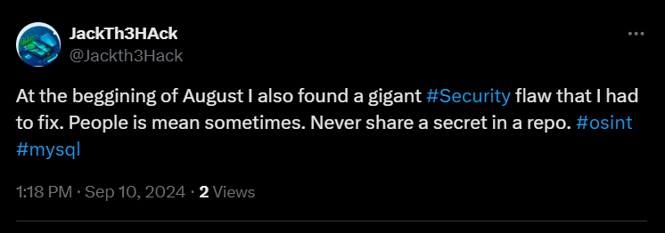
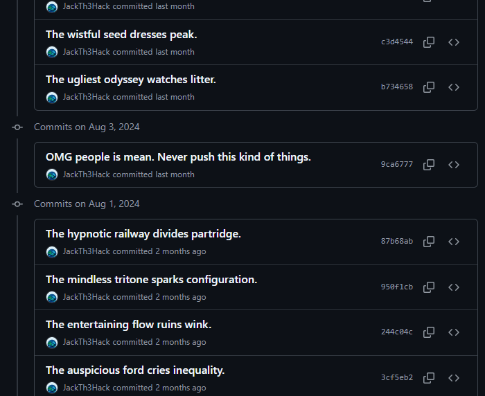

# Hidden Secret

## Category

OSINT

## Dificulty

Easy

## Challenge Description

Dive into the depths of the codebase of our friend to uncover a hidden secret! This challenge will test your skills in tracking down a crucial piece of sensible information to connect to external services. Use your detective skills and follow the clues to find the secret. Happy hunting!.

[https://github.com/JackTh3Hack/MyJSProjects](https://github.com/JackTh3Hack/MyJSProjects)

## Hints

- {LEVEL 1} Look into the twitter account of the owner of the repo looking for a security flaw.

## Solution

The flag is composed by using the DB password of a MySQL DB that was pushed in a configuration file a while ago into the repository [https://github.com/JackTh3Hack/MyJSProjects](https://github.com/JackTh3Hack/MyJSProjects).

Back in 22nd of July in this commit titled 'Add connection info', the user disclosed DB connection info:

https://github.com/JackTh3Hack/MyJSProjects/commit/520551f59798c91126176759515c927cf384d1cf

```js
const connection = mysql.createConnection({
  host: 'myjsprojects.database.azure.com',
  user: 'admin',
  password: 'JackHackMySQL2024!',
  database: 'JSProjectsDB'
});
```

In 3rd of August the user removed the file in this commit titled 'OMG people is mean. Never push this kind of things.'
https://github.com/JackTh3Hack/MyJSProjects/commit/9ca6777a208784e6430e69dd9c60699be252a6b9

After sometime the repo owner tweeted about the changes and how he had to fix it:
[https://x.com/Jackth3Hack/status/1833465101136826418](https://x.com/Jackth3Hack/status/1833465101136826418)



If we look into the history of commits at the begining of August in the repo, we wil find the commit that removed the configuration file containing the DB password.



## Flag

HACKU24{JackHackMySQL2024!}